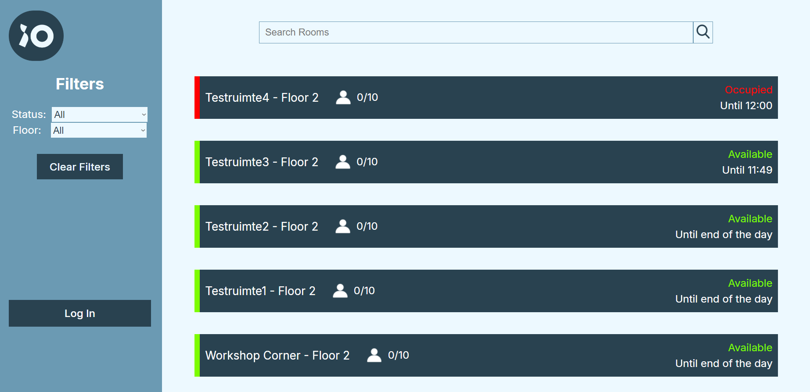

<h1 align="center">iO Digital Room Detection</h1>

<p align="center">
  
  
</p>


<p align="center">
A group project for tracking meeting room occupancy with cameras and AI-based person detection, displayed on a live dashboard. Designed for iO Digital (https://www.iodigital.com) through Fontys ICT.
</p>

<h2 align="center">Assignment</h2>
iO Digital is facing inconsistencies in their meeting room booking system, with rooms appearing as “in use” even when unoccupied. The goal of the project is to build a monitoring system that counts the number of people in a room. The data is to be processed locally and sent to a web dashboard that displays each room, its current occupancy, and its status. The system is to be scalable and capable of being implemented across multiple iO locations.

<h2 align="center">Our Solution</h2>
Firstly, using cameras, we scan the room for people while protecting their identities for privacy reasons:

<p align="center" style="margin: 20px 0;">
  
</p>
Afterwards we log the number of people in each room and in case the room is empty 15 minutes after the meeting was supposed to start, we send a warning message. If a user logs in, they can add new rooms and cameras. This ensures that the system can be easily implemented in multiple locations.

<p align="center" style="margin: 20px 0;">
  
</p>


<h2 align="center">Technologies used:</h2>

<div align="center" style="display: flex; flex-wrap: wrap; justify-content: center; gap: 8px;">
  <a href="#"></a>
  <a href="#"></a>
  <a href="#"></a>
  <a href="#"></a>
  <a href="#"></a>
  <a href="#"></a>
  <a href="#"></a>
  <a href="#"></a>

  <a href="#"></a>
  <a href="#"></a>
  <a href="#"></a>

</div>


<h2 align="center">Clone the repository:</h2>

```bash
git clone https://github.com/kaloyanrakov/iO-Room-Detection.git
cd iO-Room-Detection